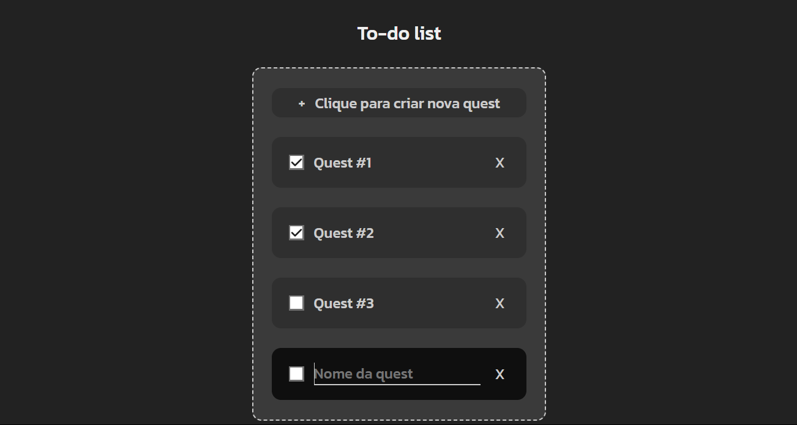
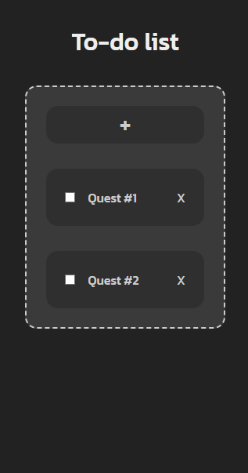

# To-do List básica
<!-- ! Colocar badges -->

  

  

  

  

## Sobre o projeto
<!-- * Descrição clara e objetiva sobre o projeto -->

Este projeto foi criado para testar e aprimorar meus conhecimentos nas linguagens HTMl, CSS e JavaScript, como base para o desing criei um projeto no figma.

Se consiste em criar objetivos/metas e dar um nome curto e intutivo para elas, e tambem após isso ao concluir é possivel dar um check para sinalizar conclusão.

## Layout do projeto
<!-- ! Por imagens tanto do site quanto do figma -->

<!-- ? Imagens funcionamento do site -->

<!-- ? Imagensdo -->

<!-- ? Imagensdo -->

## Tecnologias utilizadas
<!-- *  Listar as tecnologias utilizadas no projeto -->

- HTML
- CSS
- JavaScript
- Figma

## Autor

Lucas Conrado de Souza

Linkedin: <https://linkedin.com/in/lucas-conrado-b89208224/>

Email: <lucas.c.souza14115@gmail.com>

Feito em janeiro de 2024.
